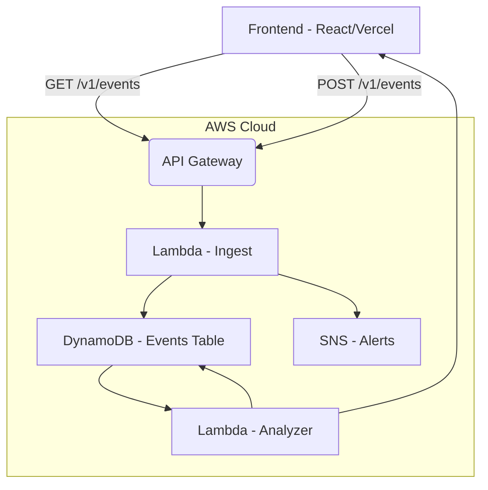

#  **NEXORA – Intelligent Resource Monitoring Platform**

**Real-time analytics, device insights, alerting system, and cloud-native backend.**
**Live Demo →** [https://nexora-teal-seven.vercel.app](https://nexora-teal-seven.vercel.app)

---

## ⭐ Overview

**Nexora** is a full-stack, cloud-native monitoring platform designed to track resource usage, visualize real-time device events, and trigger alerts based on thresholds.
It is built with a modern **React + Vite frontend**, serverless **AWS Lambda backend**, and **DynamoDB storage**, making it fully scalable and cost-efficient.

---

## 📸 Screenshots


```
/screenshots
   ├── dashboard.png
   ├── device-page.png
   ├── alerts.png
```

---

## ✨ Features

### 🔹 **Frontend (React + Vite + TailwindCSS)**

* Modern dashboard UI inspired by Dribbble
* Collapsible animated sidebar
* Real-time charts (Recharts)
* Alerts panel with filtering
* Device health & metrics page
* Smooth transitions and micro-interactions

### 🔹 **Backend (AWS Serverless)**

* AWS Lambda ingestion endpoint (`/v1/events`)
* SNS alerts when thresholds exceed
* DynamoDB for high-performance storage
* API Gateway v2 (HTTP API)
* Analyzer Lambda for aggregates (avg/max/count)

### 🔹 **DevOps / Deployment**

* Vercel deployment for frontend
* GitHub-connected CI/CD
* Fully serverless backend, minimal cost

---

## 🏗️ Architecture



---

## 📁 Project Structure

```
nexora/
│
├── frontend/              # React + Vite UI
│   ├── src/
│   │   ├── components/    # sidebar, header, cards, charts
│   │   ├── pages/         # Dashboard, Device, Alerts
│   │   ├── services/      # API calls
│   │   └── index.css
│   ├── public/
│   └── vite.config.js
│
├── ingest_lambda/
│   └── ingest.py          # POST /v1/events
│
├── analyzer_lambda/
│   └── analyzer.py        # Aggregation processor
│
├── terraform/             # IaC for AWS infra
│   └── *.tf
│
└── README.md
```

---

## 🧠 Tech Stack

### **Frontend**

* React 18
* Vite
* TailwindCSS
* Recharts
* Zustand (state management)
* Vercel

### **Backend**

* AWS Lambda
* API Gateway v2
* DynamoDB
* SNS
* Terraform

---

## 🛠️ Local Development

### **1. Clone the repository**

```sh
git clone https://github.com/Sumitcl7/nexora
cd nexora/frontend
```

### **2. Install dependencies**

```sh
npm install
```

### **3. Add API endpoint**

Create `.env`:

```
VITE_API_ENDPOINT=https://<your-api-id>.execute-api.us-east-1.amazonaws.com
```

### **4. Start dev server**

```sh
npm run dev
```

---

## ☁️ Backend Setup (AWS)

### Deploy with Terraform

```sh
cd terraform
terraform init
terraform apply
```

Creates:

* DynamoDB tables
* Lambda functions
* SNS topic
* API Gateway
* IAM roles

---

## 📡 API Endpoints

### **POST /v1/events**

Ingest an event.

**Body:**

```json
{
  "device_id": "device-123",
  "timestamp": 1699982222,
  "value": 42.7
}
```

### **GET /v1/events**

Fetch latest events.

**Response:**

```json
{
  "items": [
    {
      "device_id": "device-123",
      "timestamp": 1699982222,
      "value": 42.7
    }
  ]
}
```

---

## 🚀 Deployment

### **Frontend Deployment (Vercel)**

Connect repo → Auto-deploy on push.

Live URL:
🔗 **[https://nexora-teal-seven.vercel.app](https://nexora-teal-seven.vercel.app)**

### **Backend**

AWS Serverless via Terraform.

---

## 🧪 Testing

Use PowerShell / curl:

```sh
curl -X POST https://<api>/v1/events \
  -H "Content-Type: application/json" \
  -d "{\"device_id\":\"test\",\"timestamp\":123,\"value\":88}"
```

Fetch:

```sh
curl https://<api>/v1/events
```

---

## 📌 Roadmap

* Add authentication (Cognito / Clerk)
* Multi-device dashboards
* WebSocket real-time stream
* Editable alert rules
* AI-powered anomaly detection

---

## 🤝 Contributing

Pull requests are welcome!
Fork → Create feature branch → PR.

---

## 📄 License

MIT License © 2025 Sumit Kumar

---

## ⭐ Like this project?

Give the repo a ⭐ on GitHub!

---
